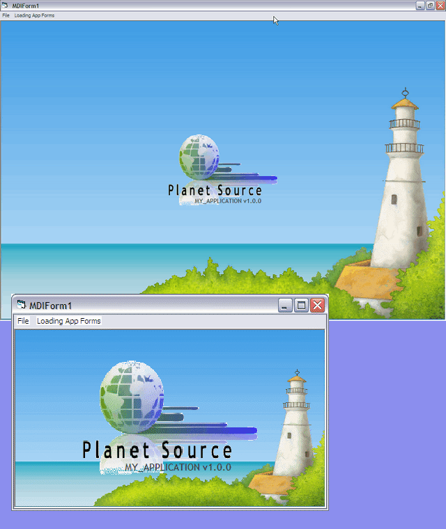



## Centralize MDI Back \(UPD\) \+ Transp Logo

### Description

A few code lines solves a old problem: Mdi Background nice resize.

No Api, no classes, no modules. The vb sample project is a very easy

copy-and-paste code in case studie with ZOrdes and Arrange samples.

See MDiForm code to read a few lines tutorial.

There are two "pizzas" too: 1) a Logo you want don't resizes

but maintain centralized in MDi area no matter which resolutions and

window measures; 2) A variable text or other control that matches logo

moves.
 
### More Info
 

             |
---                |---
**Submitted On**   |2010-11-05 19:41:54
**By**             |[JOZE Walter de Moura](https://github.com/Planet-Source-Code/PSCIndex/blob/master/ByAuthor/joze-walter-de-moura.md)
**Level**          |Intermediate
**User Rating**    |4.6 (23 globes from 5 users)
**Compatibility**  |VB 6\.0
**Category**       |[Coding Standards](https://github.com/Planet-Source-Code/PSCIndex/blob/master/ByCategory/coding-standards__1-43.md)
**World**          |[Visual Basic](https://github.com/Planet-Source-Code/PSCIndex/blob/master/ByWorld/visual-basic.md)
**Archive File**   |[Centralize2192181162010\.zip](https://github.com/Planet-Source-Code/joze-walter-de-moura-centralize-mdi-back-upd-transp-logo__1-73556/archive/master.zip)

